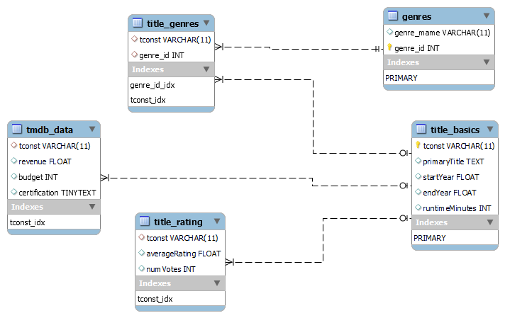

# Movies

by Israel Diaz, idiazg@udd.cl

 
## Data Description

The data correspond to the one downloaded from [IMDB source](https://datasets.imdbws.com/).

**IMDb Dataset Details**

Each dataset is contained in a gzipped, tab-separated-values (TSV) formatted file in the UTF-8 character set. The first line in each file contains headers that describe what is in each column. A ‘\N’ is used to denote that a particular field is missing or null for that title/name. The available datasets are as follows:

**title.akas.tsv.gz** - Contains the following information for titles:

* titleId (string) - a tconst, an alphanumeric unique identifier of the title
* ordering (integer) – a number to uniquely identify rows for a given titleId
* title (string) – the localized title
* region (string) - the region for this version of the title
* language (string) - the language of the title
* types (array) - Enumerated set of attributes for this alternative title. One or more of the following: "alternative", "dvd", "festival", "tv", "video", "working", "original", "imdbDisplay". New values may be added in the future without warning
* attributes (array) - Additional terms to describe this alternative title, not enumerated
* isOriginalTitle (boolean) – 0: not original title; 1: original title

**title.basics.tsv.gz** - Contains the following information for titles:

* tconst (string) - alphanumeric unique identifier of the title
* titleType (string) – the type/format of the title (e.g. movie, short, tvseries, tvepisode, video, etc)
* primaryTitle (string) – the more popular title / the title used by the filmmakers on promotional materials at the point of release
* originalTitle (string) - original title, in the original language
* isAdult (boolean) - 0: non-adult title; 1: adult title
* startYear (YYYY) – represents the release year of a title. In the case of TV Series, it is the series start year
* endYear (YYYY) – TV Series end year. ‘\N’ for all other title types
* runtimeMinutes – primary runtime of the title, in minutes
* genres (string array) – includes up to three genres associated with the title

**title.ratings.tsv.gz** – Contains the IMDb rating and votes information for titles

* tconst (string) - alphanumeric unique identifier of the title
* averageRating – weighted average of all the individual user ratings
* numVotes - number of votes the title has received

### The Movie Database API

Also, it was used the API from TMDB to perform the data enrichment to get the revenue, budget and MPAA Rating certification using the `tconst` values.

### Updates:
* 03/14/2023: Due to new data from tmdb (years 2000 to 2022) the notebooks Movies Database_3_EDA.ipynb and Movies Database_4_Transformations.ipynb have been updated, as well as the .sql database

## QUICK EDA

### Count of Movies per certification ID

### Avg Revenue per certification ID

### Avg. Budget per certification ID

## SQL DB Creation

I used sqlalchemy to build from python the sql database from pandas dataframes, the resulting database looks as the following ERD.

